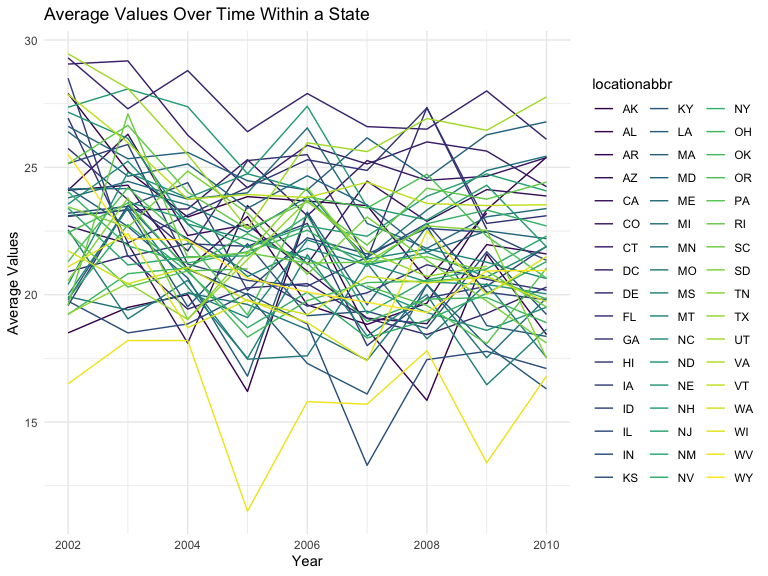
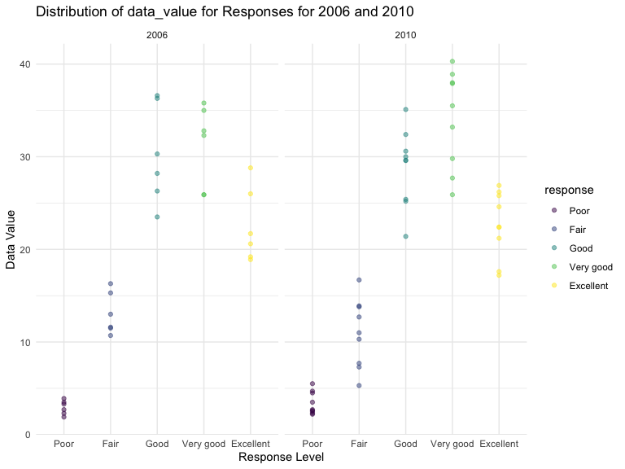

p8105_hw3_jw4489
================
2023-10-12

## Problem 1

##### Look at data.

``` r
library(p8105.datasets)
data("instacart")

instacart = 
  instacart |> 
  as_tibble()

view(instacart)
```

##### Describe the data.

This dataset contains 1384617 rows and 15 columns. Each row represents a
product from an instacart order. The dataset contains various variables,
including “order_id”, “product_id”, “add_to_cart_order”, “reordered”,
“user_id”, “eval_set”, “order_number”, “order_row”, “order_hour_of_day”,
etc. From these variables, several variables are order-level, meaning
that they describe the day and time of the order, and number of days
since prior order. And there are also several item-specific variables.
These item-specific variables describe the product names (e.g. Bulgarian
Yogurt, Spring Water), department of the products (e.g. dairy eggs,
beverages), and aisles (e.g. yogurt, water seltzer sparkling water), and
whether the item has been ordered by this user in the past. There are
39123 products found in 131209 orders from 131209 distinct users in
total.

##### Answer the questions.

``` r
instacart |> 
  count(aisle) |> 
  arrange(desc(n))
```

    ## # A tibble: 134 × 2
    ##    aisle                              n
    ##    <chr>                          <int>
    ##  1 fresh vegetables              150609
    ##  2 fresh fruits                  150473
    ##  3 packaged vegetables fruits     78493
    ##  4 yogurt                         55240
    ##  5 packaged cheese                41699
    ##  6 water seltzer sparkling water  36617
    ##  7 milk                           32644
    ##  8 chips pretzels                 31269
    ##  9 soy lactosefree                26240
    ## 10 bread                          23635
    ## # ℹ 124 more rows

There are 134 aisles. Fresh vegetables and fresh fruits are the aisles
that the most items ordered from.

``` r
instacart |> 
  count(aisle) |> 
  filter(n > 10000) |> 
  mutate(aisle = fct_reorder(aisle, n)) |> 
  ggplot(aes(x = aisle, y = n)) + 
  geom_point() + 
  labs(title = "Number of items ordered in each aisle") +
  theme(axis.text.x = element_text(angle = 60, hjust = 1))
```


The plot is made, with the number of items ordered in each aisle. And
aisles are ordered by ascending number of items following the
instruction.

``` r
instacart |> 
  filter(aisle %in% c("baking ingredients", "dog food care", "packaged vegetables fruits")) |>
  group_by(aisle) |> 
  count(product_name) |> 
  mutate(rank = min_rank(desc(n))) |> 
  filter(rank < 4) |> 
  arrange(desc(n)) |>
  knitr::kable()
```

| aisle                      | product_name                                  |    n | rank |
|:---------------------------|:----------------------------------------------|-----:|-----:|
| packaged vegetables fruits | Organic Baby Spinach                          | 9784 |    1 |
| packaged vegetables fruits | Organic Raspberries                           | 5546 |    2 |
| packaged vegetables fruits | Organic Blueberries                           | 4966 |    3 |
| baking ingredients         | Light Brown Sugar                             |  499 |    1 |
| baking ingredients         | Pure Baking Soda                              |  387 |    2 |
| baking ingredients         | Cane Sugar                                    |  336 |    3 |
| dog food care              | Snack Sticks Chicken & Rice Recipe Dog Treats |   30 |    1 |
| dog food care              | Organix Chicken & Brown Rice Recipe           |   28 |    2 |
| dog food care              | Small Dog Biscuits                            |   26 |    3 |

The table is made. It shows the three most popular items in aisles
`baking ingredients`, `dog food care`, and `packaged vegetables fruits`,
and includes the number of times each item is ordered in the table.

``` r
instacart |>
  filter(product_name %in% c("Pink Lady Apples", "Coffee Ice Cream")) |>
  group_by(product_name, order_dow) |>
  summarize(mean_hour = mean(order_hour_of_day)) |>
  pivot_wider(
    names_from = order_dow, 
    values_from = mean_hour) |>
  knitr::kable(digits = 2)
```

    ## `summarise()` has grouped output by 'product_name'. You can override using the
    ## `.groups` argument.

| product_name     |     0 |     1 |     2 |     3 |     4 |     5 |     6 |
|:-----------------|------:|------:|------:|------:|------:|------:|------:|
| Coffee Ice Cream | 13.77 | 14.32 | 15.38 | 15.32 | 15.22 | 12.26 | 13.83 |
| Pink Lady Apples | 13.44 | 11.36 | 11.70 | 14.25 | 11.55 | 12.78 | 11.94 |

The table is made. It shows the mean hour of the day at which Pink Lady
Apples and Coffee Ice Cream are ordered on each day of the week. This
table has been formatted in an untidy manner for human readers. Pink
Lady Apples are generally purchased slightly earlier in the day than
Coffee Ice Cream, with the exception of day 5.

## Problem 2

###### Look at data and do some data cleaning.

``` r
data("brfss_smart2010")

brfss = 
  brfss_smart2010 |> 
  janitor::clean_names() |>
  filter(
    topic == "Overall Health",
    response %in% c("Excellent", "Very good", "Good", "Fair", "Poor")
    ) |>
  mutate(
    response = factor(response, levels = c("Poor", "Fair", "Good", "Very good", "Excellent"), ordered = TRUE)
    )

view(brfss)
```

##### Answer the questions.

``` r
observed_2002 = brfss |>
  group_by(year, locationabbr) |>
  summarize(count = n_distinct(locationdesc), .groups = "drop") |>
  filter(year == 2002, count  >=7) |>
  arrange(desc(count)) |>
  knitr::kable(col.names = c("Year_Observed", "State_Observed", "Counts"),
               caption = "States that were observed at 7 or more locations in 2002")

observed_2010 = brfss |>
  group_by(year, locationabbr) |>
  summarize(count = n_distinct(locationdesc), .groups = "drop") |>
  filter(year == 2010, count  >=7) |>
  arrange(desc(count)) |>
  knitr::kable(col.names = c("Year_Observed", "State_Observed", "Counts"),
               caption = "States that were observed at 7 or more locations in 2010")

observed_2002
```

| Year_Observed | State_Observed | Counts |
|--------------:|:---------------|-------:|
|          2002 | PA             |     10 |
|          2002 | MA             |      8 |
|          2002 | NJ             |      8 |
|          2002 | CT             |      7 |
|          2002 | FL             |      7 |
|          2002 | NC             |      7 |

States that were observed at 7 or more locations in 2002

``` r
observed_2010
```

| Year_Observed | State_Observed | Counts |
|--------------:|:---------------|-------:|
|          2010 | FL             |     41 |
|          2010 | NJ             |     19 |
|          2010 | TX             |     16 |
|          2010 | CA             |     12 |
|          2010 | MD             |     12 |
|          2010 | NC             |     12 |
|          2010 | NE             |     10 |
|          2010 | WA             |     10 |
|          2010 | MA             |      9 |
|          2010 | NY             |      9 |
|          2010 | OH             |      8 |
|          2010 | CO             |      7 |
|          2010 | PA             |      7 |
|          2010 | SC             |      7 |

States that were observed at 7 or more locations in 2010

According to two tables generated above, we know that PA, MA, NJ, CT,
FL, NC were observed at 7 or more locations in 2002. In 2010, FL, NJ,
TX, CA, MD, NC, NE, WA, MA, NY, OH, CO, PA, SC were observed at 7 or
more locations.

``` r
excellent_response = brfss |>
  filter(response == "Excellent") |>
  group_by(year, locationabbr) |>
  summarize(average = mean(data_value), .groups = "drop") |>
  ggplot(aes(x = year, y = average, group = locationabbr, color = locationabbr)) + 
  geom_line()+
  labs(title = "Average Values Over Time Within a State",
       x = "Year",
       y = "Average Values") +
  theme_minimal()

excellent_response
```



The dataset is constructed and the “spaghetti” plot is made. The dataset
includes year, states, and average values of “excellent” responses over
time within each state, and the plot is valuable and useful in providing
information to the audience. According to the “spaghetti” plot, we can
intuitively see that the average values of “excellent” responses present
a downward trend overall. And we can also clearly see and compare each
state’s average value of “excellent” responses over time.

``` r
ny_value = brfss |>
  filter(locationabbr == "NY",
         year %in% c("2006", "2010"),
         response %in% c("Poor", "Fair", "Good", "Very good", "Excellent"))

ny_plot = ny_value |>
  ggplot(aes(x = response, y = data_value, color = response)) +
  geom_point(alpha = 0.5) +
  facet_grid(. ~ year) +
  labs(
    title = "Distribution of data_value for Responses for 2006 and 2010",
    x = "Response Level",
    y = "Data Value"
  ) +
  theme_minimal() 

ny_plot
```



## Problem 3
