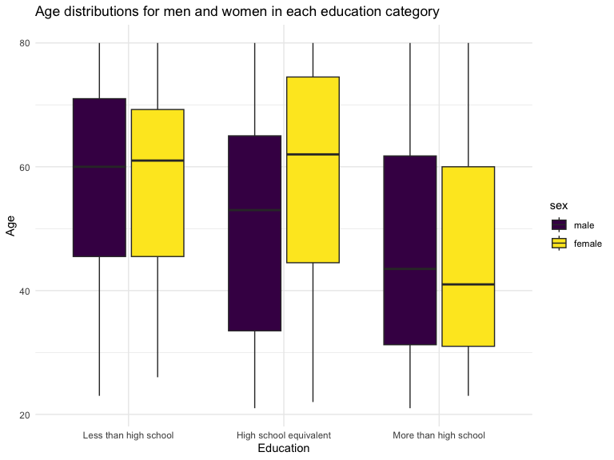
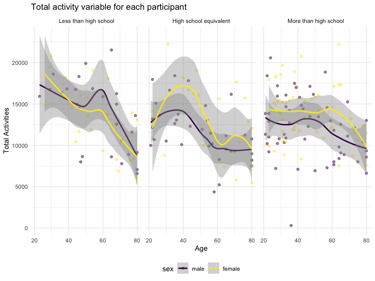
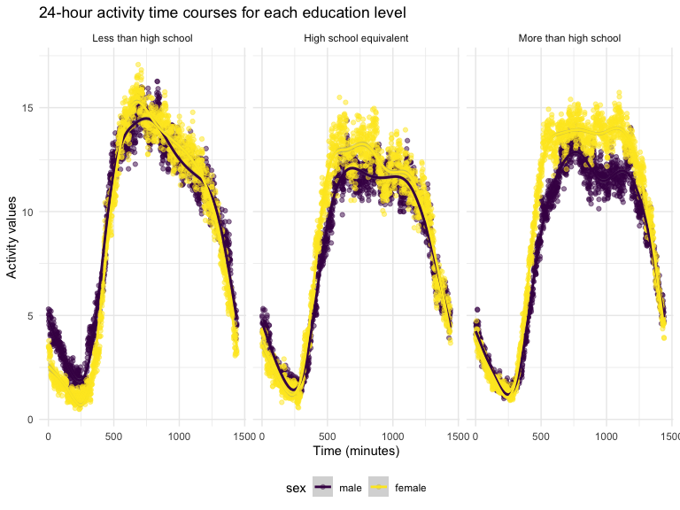

p8105_hw3_jw4489
================
2023-10-12

## Problem 1

##### Look at data.

``` r
library(p8105.datasets)
data("instacart")

instacart = 
  instacart |> 
  as_tibble()

view(instacart)
```

##### Describe the data.

This dataset contains 1384617 rows and 15 columns. Each row represents a
product from an instacart order. The dataset contains various variables,
including “order_id”, “product_id”, “add_to_cart_order”, “reordered”,
“user_id”, “eval_set”, “order_number”, “order_row”, “order_hour_of_day”,
etc. From these variables, several variables are order-level, meaning
that they describe the day and time of the order, and number of days
since prior order. And there are also several item-specific variables.
These item-specific variables describe the product names (e.g. Bulgarian
Yogurt, Spring Water), department of the products (e.g. dairy eggs,
beverages), and aisles (e.g. yogurt, water seltzer sparkling water), and
whether the item has been ordered by this user in the past. There are
39123 products found in 131209 orders from 131209 distinct users in
total.

##### Answer the questions.

``` r
instacart |> 
  count(aisle) |> 
  arrange(desc(n))
```

    ## # A tibble: 134 × 2
    ##    aisle                              n
    ##    <chr>                          <int>
    ##  1 fresh vegetables              150609
    ##  2 fresh fruits                  150473
    ##  3 packaged vegetables fruits     78493
    ##  4 yogurt                         55240
    ##  5 packaged cheese                41699
    ##  6 water seltzer sparkling water  36617
    ##  7 milk                           32644
    ##  8 chips pretzels                 31269
    ##  9 soy lactosefree                26240
    ## 10 bread                          23635
    ## # ℹ 124 more rows

There are 134 aisles. Fresh vegetables and fresh fruits are the aisles
that the most items ordered from.

``` r
instacart |> 
  count(aisle) |> 
  filter(n > 10000) |> 
  mutate(aisle = fct_reorder(aisle, n)) |> 
  ggplot(aes(x = aisle, y = n)) + 
  geom_point() + 
  labs(title = "Number of items ordered in each aisle") +
  theme(axis.text.x = element_text(angle = 60, hjust = 1))
```


The plot is made, with the number of items ordered in each aisle. And
aisles are ordered by ascending number of items following the
instruction.

``` r
instacart |> 
  filter(aisle %in% c("baking ingredients", "dog food care", "packaged vegetables fruits")) |>
  group_by(aisle) |> 
  count(product_name) |> 
  mutate(rank = min_rank(desc(n))) |> 
  filter(rank < 4) |> 
  arrange(desc(n)) |>
  knitr::kable()
```

| aisle                      | product_name                                  |    n | rank |
|:---------------------------|:----------------------------------------------|-----:|-----:|
| packaged vegetables fruits | Organic Baby Spinach                          | 9784 |    1 |
| packaged vegetables fruits | Organic Raspberries                           | 5546 |    2 |
| packaged vegetables fruits | Organic Blueberries                           | 4966 |    3 |
| baking ingredients         | Light Brown Sugar                             |  499 |    1 |
| baking ingredients         | Pure Baking Soda                              |  387 |    2 |
| baking ingredients         | Cane Sugar                                    |  336 |    3 |
| dog food care              | Snack Sticks Chicken & Rice Recipe Dog Treats |   30 |    1 |
| dog food care              | Organix Chicken & Brown Rice Recipe           |   28 |    2 |
| dog food care              | Small Dog Biscuits                            |   26 |    3 |

The table is made. It shows the three most popular items in aisles
`baking ingredients`, `dog food care`, and `packaged vegetables fruits`,
and includes the number of times each item is ordered in the table.

``` r
instacart |>
  filter(product_name %in% c("Pink Lady Apples", "Coffee Ice Cream")) |>
  group_by(product_name, order_dow) |>
  summarize(mean_hour = mean(order_hour_of_day)) |>
  pivot_wider(
    names_from = order_dow, 
    values_from = mean_hour) |>
  knitr::kable(digits = 2)
```

    ## `summarise()` has grouped output by 'product_name'. You can override using the
    ## `.groups` argument.

| product_name     |     0 |     1 |     2 |     3 |     4 |     5 |     6 |
|:-----------------|------:|------:|------:|------:|------:|------:|------:|
| Coffee Ice Cream | 13.77 | 14.32 | 15.38 | 15.32 | 15.22 | 12.26 | 13.83 |
| Pink Lady Apples | 13.44 | 11.36 | 11.70 | 14.25 | 11.55 | 12.78 | 11.94 |

The table is made. It shows the mean hour of the day at which Pink Lady
Apples and Coffee Ice Cream are ordered on each day of the week. This
table has been formatted in an untidy manner for human readers. Pink
Lady Apples are generally purchased slightly earlier in the day than
Coffee Ice Cream, with the exception of day 5.

## Problem 2

###### Look at data and do some data cleaning.

``` r
data("brfss_smart2010")

brfss = 
  brfss_smart2010 |> 
  janitor::clean_names() |>
  filter(
    topic == "Overall Health",
    response %in% c("Excellent", "Very good", "Good", "Fair", "Poor")
    ) |>
  mutate(
    response = factor(response, levels = c("Poor", "Fair", "Good", "Very good", "Excellent"), ordered = TRUE)
    )

view(brfss)
```

##### Answer the questions.

``` r
observed_2002 = brfss |>
  group_by(year, locationabbr) |>
  summarize(count = n_distinct(locationdesc), .groups = "drop") |>
  filter(year == 2002, count  >=7) |>
  arrange(desc(count)) |>
  knitr::kable(col.names = c("Year_Observed", "State_Observed", "Counts"),
               caption = "States that were observed at 7 or more locations in 2002")

observed_2010 = brfss |>
  group_by(year, locationabbr) |>
  summarize(count = n_distinct(locationdesc), .groups = "drop") |>
  filter(year == 2010, count  >=7) |>
  arrange(desc(count)) |>
  knitr::kable(col.names = c("Year_Observed", "State_Observed", "Counts"),
               caption = "States that were observed at 7 or more locations in 2010")

observed_2002
```

| Year_Observed | State_Observed | Counts |
|--------------:|:---------------|-------:|
|          2002 | PA             |     10 |
|          2002 | MA             |      8 |
|          2002 | NJ             |      8 |
|          2002 | CT             |      7 |
|          2002 | FL             |      7 |
|          2002 | NC             |      7 |

States that were observed at 7 or more locations in 2002

``` r
observed_2010
```

| Year_Observed | State_Observed | Counts |
|--------------:|:---------------|-------:|
|          2010 | FL             |     41 |
|          2010 | NJ             |     19 |
|          2010 | TX             |     16 |
|          2010 | CA             |     12 |
|          2010 | MD             |     12 |
|          2010 | NC             |     12 |
|          2010 | NE             |     10 |
|          2010 | WA             |     10 |
|          2010 | MA             |      9 |
|          2010 | NY             |      9 |
|          2010 | OH             |      8 |
|          2010 | CO             |      7 |
|          2010 | PA             |      7 |
|          2010 | SC             |      7 |

States that were observed at 7 or more locations in 2010

According to two tables generated above, we know that PA, MA, NJ, CT,
FL, NC were observed at 7 or more locations in 2002. In 2010, FL, NJ,
TX, CA, MD, NC, NE, WA, MA, NY, OH, CO, PA, SC were observed at 7 or
more locations.

``` r
excellent_response = brfss |>
  filter(response == "Excellent") |>
  group_by(year, locationabbr) |>
  summarize(average = mean(data_value), .groups = "drop") |>
  ggplot(aes(x = year, y = average, group = locationabbr, color = locationabbr)) + 
  geom_line()+
  labs(title = "Average Values Over Time Within a State",
       x = "Year",
       y = "Average Values") +
  theme_minimal()

excellent_response
```


The dataset is constructed and the “spaghetti” plot is made. The dataset
includes year, states, and average values of “excellent” responses over
time within each state, and the plot is valuable and useful in providing
information to the audience. According to the “spaghetti” plot, we can
intuitively see that the average values of “excellent” responses present
a downward trend overall. And we can also clearly see and compare each
state’s average value of “excellent” responses over time.

``` r
ny_value = brfss |>
  filter(locationabbr == "NY",
         year %in% c("2006", "2010"),
         response %in% c("Poor", "Fair", "Good", "Very good", "Excellent"))

ny_plot = ny_value |>
  ggplot(aes(x = response, y = data_value, color = response)) +
  geom_point(alpha = 0.5) +
  facet_grid(. ~ year) +
  labs(
    title = "Distribution of data_value for Responses for 2006 and 2010",
    x = "Response Level",
    y = "Data Value"
  ) +
  theme_minimal() 

ny_plot
```


## Problem 3

##### Lean the data by instruction.

``` r
nhanes_covar = read_csv("hw3_data/nhanes_covar.csv", skip = 4) |>
  janitor::clean_names() |>
  filter(age >= 21) |>
  drop_na() |>
  mutate(sex = recode(sex, "1" = "male", "2" = "female"),
         education = recode(education, "1" = "Less than high school", "2" = "High school equivalent", "3" = "More than high school")) |>
  mutate(sex = factor(sex, levels = c("male", "female")),
         education = factor(education, levels = c("Less than high school", "High school equivalent", "More than high school"))
  )
```

    ## Rows: 250 Columns: 5
    ## ── Column specification ────────────────────────────────────────────────────────
    ## Delimiter: ","
    ## dbl (5): SEQN, sex, age, BMI, education
    ## 
    ## ℹ Use `spec()` to retrieve the full column specification for this data.
    ## ℹ Specify the column types or set `show_col_types = FALSE` to quiet this message.

``` r
view(nhanes_covar)
```

``` r
nhanes_accel = read_csv("hw3_data/nhanes_accel.csv") |>
  janitor::clean_names()
```

    ## Rows: 250 Columns: 1441
    ## ── Column specification ────────────────────────────────────────────────────────
    ## Delimiter: ","
    ## dbl (1441): SEQN, min1, min2, min3, min4, min5, min6, min7, min8, min9, min1...
    ## 
    ## ℹ Use `spec()` to retrieve the full column specification for this data.
    ## ℹ Specify the column types or set `show_col_types = FALSE` to quiet this message.

``` r
view(nhanes_accel)
```

``` r
nhanes = merge(nhanes_covar, nhanes_accel, by = "seqn")

view(nhanes)
```

Hence the `nhanes` dataset includes all originally observed variables,
excludes participants less than 21 years of age, and those with missing
demographic data, and encodes data with resonable variable classes.

##### Produce a reader-friendly table and visualization.

``` r
education_number = nhanes |>
  group_by(sex, education) |>
  summarize(count = n(), .groups = "drop") 

education_table = education_number |>
  knitr::kable(col.names = c("Sex", "Education", "Counts"),
               caption = "Number of men and women in each education category")

education_table
```

| Sex    | Education              | Counts |
|:-------|:-----------------------|-------:|
| male   | Less than high school  |     27 |
| male   | High school equivalent |     35 |
| male   | More than high school  |     56 |
| female | Less than high school  |     28 |
| female | High school equivalent |     23 |
| female | More than high school  |     59 |

Number of men and women in each education category

After using the `knitr::kable` function, the table is easy and clear for
others to read. This table has a title for “Number of men and women in
each education category”, which adds context to the table and helps
users understand its purpose. It also includes column headers for “Sex,”
“Education,” and “Counts.” The “Sex” and “Education” columns provide
categorical information, while the “Counts” column shows the number of
individuals in each category.In addition, the table summarizes the count
of men and women in each education level, making it easy to compare
educational attainment between genders.

``` r
education_plot = nhanes |>
  ggplot(aes(x = education, y = age, fill = sex)) +
  geom_boxplot() + 
  labs(
    title = "Age distributions for men and women in each education category",
    x = "Education", 
    y = "Age"
  ) +
  theme_minimal() 

education_plot
```



After comparing different kinds of plots, I found that box plot can make
better and more effective visualization for this dataset. Box plots are
effective to display the distribution of the continuous variable (age)
across different groups (education categories) and allow for the
comparison of central tendencies, variability, and potential outliers.
Its title, x-axis label, and y-axis label can also provide clear context
for the plot, making it easy to understand. The plot generated in this
step shows box plots for different education levels on the a-axis, with
each category labeled (“less then high school”, “high school
equivalent”, “more than high school”). The y-axis represents the age of
individuals (The range showed in the plot is 20 to 80 years old). The
box plots are filled with different colors to represent the gender (male
and female), helping in visually comparing the age distributions of men
and women within each education level. The title of this plot “age
distributions for men and women in each education category” also
provides audience with useful information. From this plot, we can also
see that for people that are less than high school or high school
equivalent, women have an average age which is larger than that of men.
However, men have a larger average age than women in the people who have
the degree that is higher than high school.

``` r
total_plot = nhanes |>
   mutate(
    activities = rowSums(across(min1:min1440))
    ) |>
  ggplot(aes(x = age, y = activities, color = sex)) +
  geom_point(alpha = .5) +
  geom_smooth() +
  facet_grid(. ~ education) +
  labs(title = "Total activity variable for each participant",
       x = "Age",
       y = "Total Activities")

total_plot
```

    ## `geom_smooth()` using method = 'loess' and formula = 'y ~ x'



The plot compares the total activity variable (representing daily
activity) against age for men and women across different education
levels. The use of different colors for mea and women makes it easy to
distinguish between the two genders on the plot. The inclusion of the
smoothing curves provides a visual summary of the trends in the data.
THese lines help in understanding the relationships between age and
total activity, and comparing those for each gender and education level.
Faceting by education levels allows for a separate view of the data for
each subgroup, making it easier to identify any variations or patterns
within different educational attainment categories.The title “total
activity variable for each participant” and axis labels (minutes of
total activities and ages) enhance the interpretability of the plot,
providing a clear context for what is being visualized. From this plot,
we can clearly the total activities trend downwardly as age getting
older for all groups of people. Among the people who have high school
degree or higher, female tend to have more total activity time then
male. However, it is opposite among people who have degree that under
high school.

``` r
activity_plot = nhanes |>
  group_by (education, sex)|>
  summarize(across(starts_with("min"), ~ mean(.), .names = "mean_{.col}"),.groups = "drop") |>
  pivot_longer(cols = starts_with("mean_"), names_to = "time", values_to = "mean")|>
  mutate(time = substring(time, 9),
         time = as.numeric(time)) |>
  ggplot(aes(x = time, y = mean, color = sex)) +
  geom_point(alpha = 0.5) +
  geom_smooth() +
  facet_grid(. ~education) +
  labs(title = "24-hour activity time courses for each education level", 
       x = "Time (minutes)",
       y = "Activity values")

activity_plot
```

    ## `geom_smooth()` using method = 'gam' and formula = 'y ~ s(x, bs = "cs")'



This plot shows the 24-hour activity time courses for each education
level, with sex indicated by color. From the plot, we can see that
people who gain the degree below the high school have the highest
activity time (around 750 minutes). We can also see that all kind of
people follows the same pattern of activity times.
